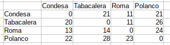

## Reto 03

`mas_centrico.py`

Un usuario de Bedu Bikes se encontrará con otros amigos y busca el lugar más centrico de todos. Ha seleccionado 4 destinos, en diferentes puntos de la ciudad. La selección del usuario está formada de la siguiente manera en un array de numpy:



Los tiempos totales deberán calcularse recorriendo por columna. Se recibirán 2 parámetros:
1. Lista de lugares
2. Array de numpy con amenidades/destinos

Definidos de la siguiente manera, por ejemplo:
```python
destinos = ["Condesa", "Tabacalera", "Roma", "Polanco"]

valores = np.array([[0, 21, 11, 21], 
                    [20, 0, 11, 26], 
                    [13, 14, 0, 24], 
                    [ 22, 28, 23, 0]])
```
El lugar más centrico debe de ser el menor tiempo de IDA y VUELTA del resto de lugares:
```
$ python mas_centrico.py

El lugar más centrico es Roma con 51 minutos de ida y 45 de vuelta.

```
