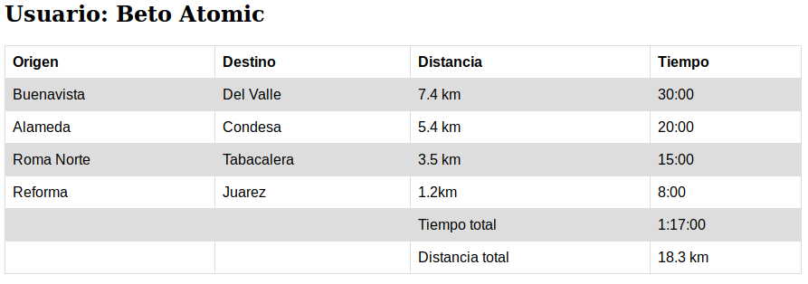

## Reto 01

`index.html`

Modifica el archivo `index.html`, para que muestre información simulada acerca de un usuario de Bedu Bikes. Puedes utilizar estilos, pero es opcional. Corre el servidor de Python para revisar sus resultados.

ordena por precio y gráfica los datos.