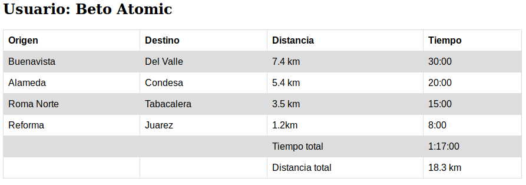

## Reto 02

`usuario_html.py`

Mostrar con el servidor web, una tabla de usuario con información variable, obtenida a partir de un archivo CSV.
Modifica el archivo CSV para verificar su funcionamiento.

