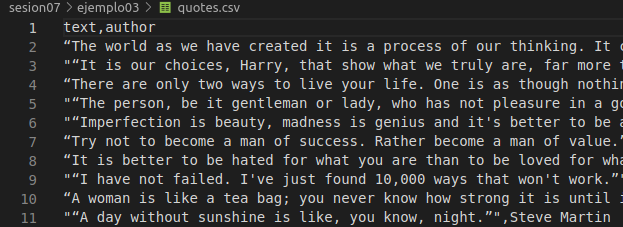

 # Ejemplo 03

 ## Scrapy

 Scrapy es una librería de Python, que aparte de realizar tareas de *scraping*, como BeautifulSoup, también permite hacer tareas de *crawling*, esto es, navegar entre diferentes páginas. Permite realizar la tarea de forma más automatizada que BS.

 ## Instalación

 La instalación se hace de forma similar a cualquier programa de Python.

 `$ pip install scrapy`

 ## Spiders

El funcionamiento de Scrapy comparado con BeautifulSoup, es un poco diferente. Para realizar una tarea de *scraping*, es necesario crear nuestra propia clase que herede de scrapy.Spider.

Para correr un spider, se tiene que utilizar el comando: `scrapy runspider`.

```
$ scrapy runspider

Usage
=====
  scrapy runspider [options] <spider_file>

Run the spider defined in the given file

Options
=======
--help, -h              show this help message and exit
-a NAME=VALUE           set spider argument (may be repeated)
--output=FILE, -o FILE  dump scraped items into FILE (use - for stdout)
--output-format=FORMAT, -t FORMAT
                        format to use for dumping items with -o
```

Como se puede ver, se debe indicar el nombre de archivo donde se encuentra el spider, y se puede elegir el formato para guardar la información.

## Mi primer araña (spider)

`primer_spider.py`

Utilizar spider para obtener todas las citas bibliográficas del sitio: https://quotes.toscrape.com, siguiendo la paginación.


```
$ scrapy runspider primer_spider.py -o quotes.csv
```



